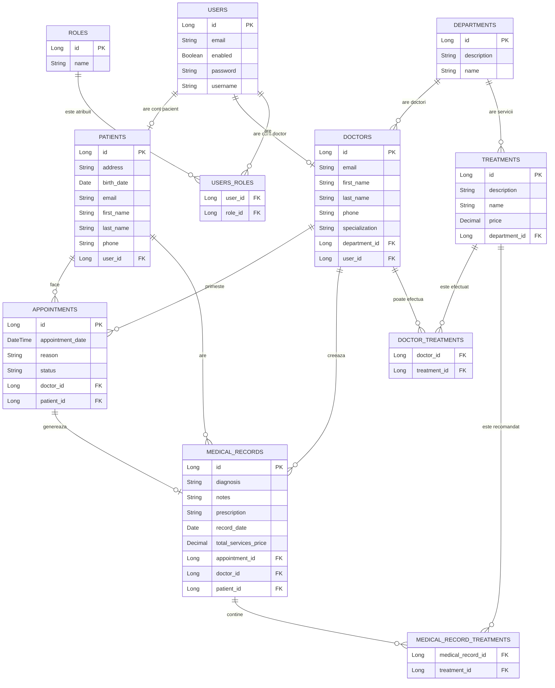

# Medical Test Clinic - Aplicatie de gestionare a unei clinici medicale 

Medical Test Clinic este o aplicație web dezvoltată în Java Spring Boot pentru administrarea unei clinici medicale. Aplicația permite gestionarea doctorilor, pacienților, departamentelor, serviciilor medicale, programărilor și fișelor medicale.

Proiectul este structurat pe 3  roluri: administrator, doctor și pacient. Fiecare rol are acces doar la funcționalitățile sale .

---

## Tehnologii folosite

- Java 17
- Spring Boot 3
- Spring MVC
- Spring Data JPA
- Spring Security
- Thymeleaf
- PostgreSQL
- H2 Database pentru testare
- Maven
- Lombok
- JUnit 5
- Mockito
- HTML
- CSS

---

## Roluri în aplicație

Aplicația folosește autentificare și autorizare prin Spring Security.

### ADMIN

Administratorul poate:

- gestiona doctori;
- crea conturi pentru doctori;
- gestiona pacienți;
- gestiona departamente;
- gestiona servicii medicale;
- gestiona programări;
- vizualiza și edita fișe medicale;
- șterge entități din aplicație.

### DOCTOR

Doctorul poate:

- vedea programările proprii;
- accepta sau refuza programări;
- finaliza consultații;
- crea fișe medicale pentru pacienți;
- edita fișele medicale create de el;
- vedea serviciile recomandate și totalul acestora.

### PATIENT

Pacientul poate:

- crea o programare;
- vedea programările proprii;
- anula programările care nu sunt finalizate;
- vedea fișele medicale proprii;
- vedea diagnosticul, prescripția și serviciile recomandate.

---

## Modelul de date

Aplicația conține următoarele entități principale:

- User
- Role
- Patient
- Doctor
- Department
- Appointment
- MedicalRecord
- Treatment(reprezinta serviciile oferite de clinica)

---

## Relații între entități

- User - Role: Many-to-Many
- User - Patient: One-to-One
- User - Doctor: One-to-One
- Department - Doctor: One-to-Many
- Department - Treatment: One-to-Many
- Patient - Appointment: One-to-Many
- Doctor - Appointment: One-to-Many
- Appointment - MedicalRecord: One-to-One
- MedicalRecord - Treatment: Many-to-Many
- Doctor - Treatment: Many-to-Many

O regulă importantă implementată este că **o programare poate avea o singură fișă medicală**, dar un pacient poate avea mai multe fișe medicale pentru programări diferite.

---

## Diagrama ER


## Funcționalități principale

### Administrare doctori

- adăugare doctor;
- creare cont pentru doctor;
- editare doctor;
- ștergere doctor;
- asociere doctor cu departament;
- ștergerea doctorului împreună cu relațiile asociate.

### Administrare pacienți

- adăugare pacient;
- creare cont pacient;
- editare pacient;
- ștergere pacient;
- vizualizare pacienți;
- ștergerea pacientului împreună cu programările și fișele asociate.

### Administrare departamente

- adăugare departament;
- editare departament;
- ștergere departament;
- asociere departament cu doctori;
- asociere departament cu servicii medicale;
- ștergerea serviciilor medicale asociate departamentului șters.

### Administrare servicii medicale

- adăugare serviciu medical;
- asociere serviciu cu departament;
- editare serviciu;
- ștergere serviciu;
- preț pentru fiecare serviciu;
- servicii afișate în fișa medicală în funcție de departamentul doctorului.

### Programări

- pacientul poate crea programări;
- adminul poate crea programări;
- programările se fac între 08:00 și 18:00;
- programările sunt disponibile din 30 în 30 de minute;
- doctorul poate accepta sau refuza programări;
- doctorul poate finaliza consultații;
- pacientul poate anula doar programările care nu sunt finalizate;
- adminul poate gestiona programările;
- nu se pot crea programări în trecut;
- nu se pot crea două programări pentru același doctor la aceeași dată și oră.

### Fișe medicale

- doctorul poate crea fișă medicală pentru o programare acceptată sau finalizată;
- aceeași programare nu poate avea două fișe medicale;
- fișa medicală conține diagnostic, prescripție, observații și servicii recomandate;
- serviciile medicale sunt filtrate după departamentul doctorului;
- totalul serviciilor recomandate se calculează automat;
- pacientul poate vedea doar fișele medicale proprii;
- adminul poate vizualiza și edita fișele medicale.

---

## Validări

Aplicația folosește validări server-side prin Jakarta Validation și reguli de business în Service Layer.

Exemple de validări:

- câmpuri obligatorii;
- email unic pentru doctori și pacienți;
- username unic pentru conturile de utilizator;
- validare preț serviciu medical;
- validare status programare;
- programările nu pot fi create în trecut;
- programările se pot face doar între 08:00 și 18:00;
- programările trebuie să fie din 30 în 30 de minute;
- o programare nu poate avea mai multe fișe medicale;
- doctorul poate accepta/refuza doar programări cu status `SCHEDULED`;
- doctorul poate finaliza doar programări cu status `ACCEPTED`;
- pacientul nu poate anula programări finalizate.

Există și validări client-side prin HTML:

- `required`;
- `type="email"`;
- `type="date"`;
- `type="number"`;
- `min`;
- `step`.

---

## Securitate

Aplicația folosește Spring Security.

Funcționalități de securitate:

- login custom;
- logout;
- roluri: `ADMIN`, `DOCTOR`, `PATIENT`;
- acces protejat pe endpoint-uri;
- parole criptate cu BCrypt;
- useri asociați cu doctori sau pacienți;
- acces separat pentru fiecare rol;
- pacientul poate vedea doar datele lui;
- doctorul poate vedea doar programările și fișele proprii.

---

## Paginare și sortare

Aplicația include paginare și sortare pentru listele principale:

- doctori;
- pacienți;
- departamente;
- servicii medicale;
- programări;
- fișe medicale.

Paginarea și sortarea sunt facute folosind `Pageable`, `PageRequest` și `Sort` din Spring Data JPA.

---

## Logging

Aplicația folosește SLF4J prin Lombok `@Slf4j`.

Sunt logate operații importante precum:

- creare entitate;
- citire entitate;
- actualizare entitate;
- ștergere entitate;
- gestionare programări;
- gestionare fișe medicale;
- operații importante din service layer.

---

## Multi-environment

Aplicația are configurații separate pentru medii diferite.

### Profil dev

Profilul `dev` folosește PostgreSQL pentru rularea normală a aplicației.

Exemplu configurare:

```yaml
spring:
  datasource:
    url: jdbc:postgresql://localhost:5432/clinic_db
    username: postgres
    password: your_password_here

  jpa:
    hibernate:
      ddl-auto: update
```

### Profil test

Profilul `test` folosește H2 in-memory pentru testare.

Exemplu configurare `application-test.yml`:

```yaml
spring:
  datasource:
    url: jdbc:h2:mem:clinic_test_db
    driver-class-name: org.h2.Driver
    username: sa
    password:

  jpa:
    database-platform: org.hibernate.dialect.H2Dialect
    hibernate:
      ddl-auto: create-drop
    show-sql: true
```

Testele care folosesc profilul `test` nu afectează baza de date reală PostgreSQL.

---

## Testare

Au fost realizate teste unitare pentru service  folosind JUnit 5 și Mockito.

Clase de test:

- `MedicalRecordServiceTest`
- `DoctorServiceTest`
- `PatientServiceTest`
- `AppointmentServiceTest`

Funcționalități testate:

- crearea fișelor medicale;
- calcularea totalului serviciilor medicale;
- regula că o programare poate avea o singură fișă medicală;
- crearea doctorilor cu cont;
- validarea emailului și username-ului duplicat;
- crearea pacienților;
- actualizarea pacienților;
- ștergerea pacienților împreună cu relațiile asociate;
- crearea programărilor;
- actualizarea programărilor;
- anularea programărilor;
- căutarea entităților după ID;
- tratarea cazurilor în care entitatea nu există.

Testele unitare folosesc mock-uri pentru repository-uri, deci nu modifică baza de date reală.

---

## Cum se rulează aplicația

### 1. Cerințe necesare

Pentru rularea aplicației sunt necesare:

- Java 17;
- Maven;
- PostgreSQL;
- un IDE precum Eclipse sau IntelliJ.

### 2. Crearea bazei de date

În PostgreSQL se creează baza de date:

```sql
CREATE DATABASE clinic_db;
```

### 3. Configurarea conexiunii

În fișierul:

```text
src/main/resources/application-dev.yaml
```

se configurează conexiunea la PostgreSQL:

```yaml
spring:
  datasource:
    url: jdbc:postgresql://localhost:5432/clinic_db
    username: postgres
    password: your_password_here
```

`your_password_here` trebuie înlocuit cu parola locală de PostgreSQL.

### 4. Pornirea aplicației

Aplicația poate fi pornită din IDE sau cu Maven:

```bash
mvn spring-boot:run
```

Aplicația va fi disponibilă la:

```text
http://localhost:8080
```

---

## Cont demo

La prima pornire a aplicației pot fi create rolurile și conturile necesare fie prin interfața aplicației, fie printr-un initializer de date.

Exemplu cont administrator:

```text
Username: admin
Password: admin123
```

După autentificare, administratorul poate crea doctori, pacienți, departamente, servicii medicale și programări.

---

## Cum se rulează testele

Testele se pot rula cu Maven:

```bash
mvn test
```

Sau din Eclipse:

```text
Right click pe clasa de test → Run As → JUnit Test
```

---

## Structura aplicației

Proiectul este organizat pe straturi:

```text
src/main/java/com/example/clinic
```

- `controller` - gestionează requesturile web;
- `service` - conține logica aplicației;
- `repository` - comunică cu baza de date;
- `entity` - conține entitățile JPA;
- `exception` - conține excepții custom;
- `config` - conține configurări pentru securitate și inițializare;
- `templates` - paginile Thymeleaf;
- `static/css` - stilizarea aplicației;
- `test` - testele unitare.

---

## Reguli implementate

- Un doctor nu poate avea două programări la aceeași dată și oră.
- Programările nu pot fi create în trecut.
- Programările sunt disponibile doar între 08:00 și 18:00.
- Programările sunt disponibile din 30 în 30 de minute.
- O programare poate avea o singură fișă medicală.
- Un pacient poate avea mai multe fișe medicale pentru programări diferite.
- Doctorul poate crea fișe doar pentru programări acceptate sau finalizate.
- Pacientul poate anula doar programările care nu sunt finalizate.
- Serviciile medicale recomandate sunt filtrate după departamentul doctorului.
- Totalul serviciilor recomandate este calculat automat.
- Pacientul vede doar fișele lui medicale.
- Doctorul vede doar programările și fișele proprii.

---
